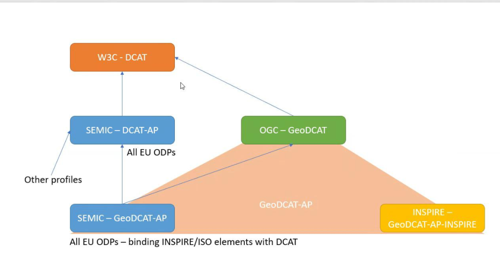

# Meeting notes ad hoc meeting 
22 nov 2022 Ad hoc meeting on GeoDCAT SWG formation. 

The meeting was recorded. 

Session kickoff by Linda van den Brink
- There was talk a few years ago already about standardizing GeoDCAT in OGC; recently the idea was discussed again and a draft charter written. Today we are here to discuss the charter; if we agree about the contents, so about the work we want to do, then the charter will go to public comment and OGC member vote. After approval the SWG can be started. 
- Instead of a SWG and full standards track it is also possible to bring GeoDCAT in as a community standard, in which case OGC would not change anything and not do any work except public comment + approving. 

Round of introductions
- Bert van Nuffelen. From SEMIC group. One of the editors of GeoDCAT-AP and supporting the Flemisch government. Wants to clarify how the governance works. 
- Pavlina Fragkou: Also on SEMIC team. SEMIC is the semantic interoperability community, part of DIGIT D2 dealing with semantic vocabs, also the core vocabularies including Core Location. Part of European Commission.
- Danny Vandenbroucke from University Leuven, co-chair of MetaCat DWG. He was involved in the earlier discussions about standardizing GeoDCAT. Idea was at first to go from discussion paper to best practice with implementation details, followed by a community standard. The work stalled because of covid etc. Is working on harvesting European data portals. Sees DCAT popping up everywhere, wants to contribute to SWG.
- Byron: New Zealand. Data quality becoming more important. Involved in metadata codesprint. DCAT very much in the mind of people there. People want to express metadata in RDF format, perhaps the main format. Many applications. 
- Christopher Budas: DSTL, UK. Curious observor.
- Peter Parslow: Ordnance Survey, UK. Responsible for structured metadata. Lead for UK metadata standard. British government is looking to use DCAT. Big difference between civil and defense standards in UK. 
- Margie Smith: Geoscience Australia, using 19115 metadata. Exploring DCAT across government.
- Edward (?), colleague of Margie. Editor of 19115-3 (xml). 
- Linda van den Brink, Geonovum in the Netherlands. Convened this meeting because chair of GeoSemantics DWG. Colleague Ine de Visser knows much more about metadata, but could not join today.

Discussion
- Linda: should GeoDCAT be a full standard or community standard? The charter proposes a full standard, and to create a geospatial extension of DCAT, leaving out the 'AP' part. 
- Danny: in the discussion paper, the idea was to describe examples, but the work wasn't finished. Most examples were from Europe. Describing implementations could still be good. It would be good if OGC takes care of it, especially now that there is worldwide interest and use. It would be GeoDCAT 3.0.
- Byron: biggest concern is having a place where it is maintained and kept up to date. Also, connection with W3C, ISO, STAC, OGC Records, etc are important. Community standard process doesn't always work, see GeoJSON, LandInfra (team didn't like what OGC was doing). 
- Bert: shows slide with relations between DCAT, DCAT-AP, GEoDCAT-AP, GeoDCAT and INSPIRE. DCAT-AP gives guidelines for data portals across Europe. GeoDCAT-AP would be a specialization of DCAT-AP from our perspective. GeoDCAT-AP has been inspired by the INSPIRE directive GeoDCAT-AP-INSPIRE. Have to figure out if this is part of the story or out of scope. Contains mapping between ISO 19115 and DCAT. OGC GeoDCAT would be a global thing, specific for geospatial data. Good thing is that OGC GeoDCAT would be driven by geospatial needs. But geospatial needs are also influencing W3C DCAT (e.g. dataset series). How would OGC and W3C collaborate and what is the difference? If I leave out the AP, i.e. the European requirements, there is not much left. It will be close to W3C DCAT. This is my feeling, the analysis is yet to be done. From SEMIC perspective we want to have this triangle clear. Sometimes we push things to W3C, if we feel something is a global requirement.

- Byron: NZ moving to new 19115-3, Europe is not doing this yet, there are some differences. This is holding us back. 
- Bert: there is a mapping to 19115-2014. Looking for input on whether this needs updating. 
- Byron: this is the old one, NZ and Australia keen on mapping to new 2020 version. 
- Danny: this mapping is a few years old, not tested. INSPIRE is using the 2003 version of ISO 19115. Work item would be to analyze difference between DCAT and GeoDCAT. Maybe it's good to chase relevant recent experiments / work. Charter says first action would be to update the discussion paper. But we have to decide if we want to work on GeoDCAT version x. It would be good to know who takes responsibility (i.e. OGC). INSPIRE less important for me.
- Bert: there is a difference between responsiblity and governance. And a difference between INSPIRE requirements and EU data portal requirements. INSPIRE changes will also be slower. 
- Peter: we need to consider OGC API Records and W3C DCAT 3 work. Records has collected their own small core of properties, DCAT-like. In the code sprint some people were interested in DCAT / ISO19115 / Records core mapping. And DCAT 3 work: we could also joint the DCAT wg at W3C, and get what we want adopted in there. 
- Byron: would be beneficial to get vocabularies people on board, also Nick Car. 
- Peter: ISO is generating SKOS vocabularies from TC211 standards
- Pavlina: DCAT-AP will align with DCAT 3. 
- Danny: anyone aware about statistical community? 
- Pavlina: not doing anything right now. But in contact with them. 

Next steps
- Linda: another meeting is needed to discuss further. Please everyone read the charter in preparation. 